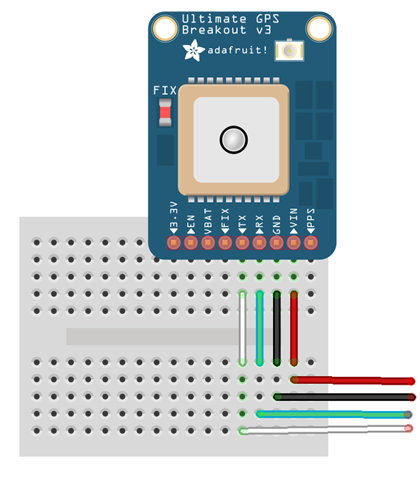

# GPS Breakout - MKT3339

The breakout is built around the MTK3339 chipset, a no-nonsense, high-quality GPS module that can track up to 22 satellites on 66 channels, has an excellent high-sensitivity receiver (-165 dB tracking!), and a built in antenna. It can do up to 10 location updates a second for high speed, high sensitivity logging or tracking. Power usage is incredibly low, only 20 mA during navigation.

This GPS Breakout bord comes directly from Adafruit. You can find the product description [here](https://www.adafruit.com/products/746) and a detail tutorial [here](https://learn.adafruit.com/adafruit-ultimate-gps-on-the-raspberry-pi/introduction). Furthermore everything you need to know is noted in this document.

## Wiring the GPS Breakout up

There are only 4 cables needed to connect the GPS Breakout to your Raspberry Pi.




## Installation

At first you need to install gps Deamon (gpsd)

```
sudo apt-get install gpsd gpsd-clients python-gps
```

If you want to manually start and stop the deamon on a local socket you need to stop and disable gpsd service.
```
sudo systemctl stop gpsd.socket
sudo systemctl disable gpsd.socket
```

To enable the service again you run the following:
```
sudo systemctl enable gpsd.socket
sudo systemctl start gpsd.socket
```

## Testing
If you want to run the service manually you need to start the deamon with the USB to TTL adapter and the default socket.
```
sudo gpsd /dev/ttyUSB0 -F /var/run/gpsd.sock
```

The manually started deamon will be running until the next reboot or you shutdown the deamon by typping:
```
sudo gpsd /dev/ttyUSB0 -F /var/run/gpsd.sock
```
Note: ```/dev/ttyUSB0```is you USB to TTL adapter. You can find out the name of you adapter by running ```sudo lsusb```. You will have either a ```PL2303``` or ```CP2102``` chipset.

To restart the deamon just kill the deamon on fire up the gpsd again:
```
sudo killall gpsd
sudo gpsd /dev/ttyUSB0 -F /var/run/gpsd.sock
```

## Getting Data

It is fairly easy to read data from the GPS Breakout, because you can get the data from a local TCP Socket:
import gps

```
# Listen on port 2947 (gpsd) of localhost
session = gps.gps("localhost", "2947")
session.stream(gps.WATCH_ENABLE | gps.WATCH_NEWSTYLE)

while True:
    try:
    	report = session.next()
		# Wait for a 'TPV' report and display the current time
		# To see all report data, uncomment the line below
		# print report
        if report['class'] == 'TPV':
            if hasattr(report, 'time'):
                print report.time
    except KeyError:
		pass
    except KeyboardInterrupt:
		quit()
    except StopIteration:
		session = None
		print "GPSD has terminated"
```

Note: Check out the ```report``` varibale to get the needed information for your installation.

## Using UART instead of the USB to TTL adapter

We dont recommend to use the UART (Serial Connector) directly, because it isnt possible anymore to login via the console cable. But if you wish to enable the communication between the GPS Breakout and the serial port just following the Adafruit Tutorial (https://learn.adafruit.com/adafruit-ultimate-gps-on-the-raspberry-pi/using-uart-instead-of-usb).

## Examples
