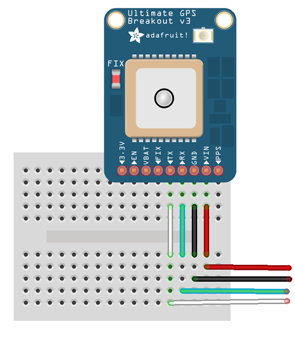

# GPS Breakout - MKT3339

The breakout is built around the MTK3339 chipset, a no-nonsense, high-quality GPS module that can track up to 22 satellites on 66 channels, has an excellent high-sensitivity receiver (-165 dB tracking!), and a built in antenna. It can do up to 10 location updates a second for high speed, high sensitivity logging or tracking. Power usage is incredibly low, only 20 mA during navigation.

This GPS Breakout bord comes directly from Adafruit. You can find the product description [here](https://www.adafruit.com/products/746) and a detail tutorial [here](https://learn.adafruit.com/adafruit-ultimate-gps-on-the-raspberry-pi/introduction). Furthermore everything you need to know is noted in this document.

## Wiring the GPS Breakout up

There are only 4 cables needed to connect the GPS Breakout to your Raspberry Pi.




## Installation

At first you need to install gps Deamon (gpsd)

```
sudo apt-get install gpsd gpsd-clients python-gps
```

To get data you can run the gps client cgps with the command ```cpgs -s``` or ```telnet localhost 2947```. If you want to get the raw data from the USB Device directly you can just grep the data from the USB Device itself with the command ```cat /dev/ttyUSB0```.

If you want to manually start and stop the deamon on a local socket you need to stop and disable gpsd service.
```
sudo systemctl stop gpsd.socket
sudo systemctl disable gpsd.socket
```

To enable the service again you run the following:
```
sudo systemctl enable gpsd.socket
sudo systemctl start gpsd.socket
```

## Testing
If you want to run the service manually you need to start the deamon with the USB to TTL adapter and the default socket.
```
sudo gpsd /dev/ttyUSB0 -F /var/run/gpsd.sock
```

Note: ```/dev/ttyUSB0```is you USB to TTL adapter. You can find out the name of you adapter by running ```sudo lsusb```. You will have either a ```PL2303``` or ```CP2102``` chipset.

To restart the daemon just kill the daemon on fire up the gpsd again:
```
sudo killall gpsd
sudo gpsd /dev/ttyUSB0 -F /var/run/gpsd.sock
```

## Examples

As mentioned above there are three ways (```cgps -s```, ```telnet localhost 2947``` or ```cat /dev/ttyUSB0```) to get the data from the GPS Breakout board. If you want to develop something by yourself you can checkout the python examples in the ```MTK3399/example/``` folder.
